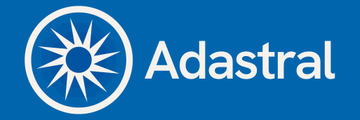

# The Adastral GUI Client

This repository contains the entire codebase for the Adastral GUI client - this includes:
- Belmont, the UI component
- Winter, the C++ component, which in turn contains:
  - Palace, the L2 "glue" component
  - Emley, our modified version of TF2c's "Kachemak" versioning system (L1)

## Building
Github Actions is set up for both Windows and Linux, so builds can be grabbed off of there, but if you want to work on either codebase, what you need to do is usually:
- build winter
- copy the libraries into belmont
- launch the program from belmont

To build winter, you'll need to install ``libtorrent-rasterbar`` and ``curl`` (and ``libnotify`` on linux), then configure with cmake
- include the following on the command line when running cmake to enable building the bindings:
```-DGODOT=1 -DGODOT_GDEXTENSION_DIR="gdextension" -DGODOT_CPP_SYSTEM_HEADERS=ON```
- Then just move the libraries located in `winter/Code/binding/lib` (especially `winter-x64-debug`) to `belmont/bin`
- You should be good to launch the Godot project and fire up Adastral.


## License

Adastral is licensed under the GPLv3.

Winter uses various libraries and components under different licenses:
- libtorrent-rasterbar: BSD 2-Clause Licence
- [zip](https://github.com/kuba--/zip): MIT License
- sha256.cpp: zlib License
- tinyfiledialogs: zlib License
- libcurl: curl License